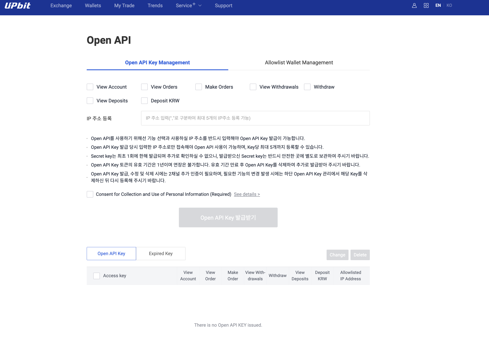

# Golang Upbit API Client
This project provides an easy-to-use Golang client for interaction with the Upbit cryptocurrency exchange API.

# Upbit API Docs
- [upbit api docs](https://docs.upbit.com)

# How to Use
1. Installation: To install the client, use the following command:

```bash
go get github.com/wooobo/go-upbit-client
```

2. Example Usage:

```go
func main() {
  client := NewClient(Config{
    BaseUrl: testUrl,
    Version: testVer,
  })
  
  actual, err := client.GetMarkets(context.Background(), false)
  
  if err != nil {
    t.Errorf("GetMarkets() error = %v", err)
  }
  
  if len(actual) == 0 {
    t.Errorf("GetMarkets() got empty response")
  }
}
```
3. Example

- examples 폴더 참고
  - examples/markets 폴더를 통해 Public API 사용 예제 확인
  - examples/socket 폴더를 통해 소켓 API 사용 예제 확인

# Features

## Quotation API

- 시세 종목 조회
  - [x] 종목 코드 조회
    - url: `/market/all`
    - method: `GET`
- 시세 캔들 조회
  - [x] 분(Minute) 캔들
    - url: `https://api.upbit.com/v1/candles/minutes/{unit}
    - method: `GET`
  - [x] 일(Day) 캔들
    - url: `https://api.upbit.com/v1/candles/days`
    - method: `GET`
  - [x] 주(Week) 캔들
    - url: `https://api.upbit.com/v1/candles/weeks`
    - method: `GET`
  - [x] 월(Month) 캔들
    - url: `https://api.upbit.com/v1/candles/months`
    - method: `GET`
- 시세 체결 조회
  - [x] 최근 체결 내역
    - url: `https://api.upbit.com/v1/trades/ticks`
    - method: `GET`
- 시세 현재가(Ticker) 조회
  - [x] 종목 단위 현재가 정보
    - url: `https://api.upbit.com/v1/ticker`
    - method: `GET`
  - [x] 마켓 단위 현재가 정보
    - url: `https://api.upbit.com/v1/ticker/all`
    - method: `GET`
- 시세 호가 정보(Orderbook) 조회
  - [x] 호가 정보 조회
    - url: `https://api.upbit.com/v1/orderbook`
    - method: `GET`
  - [x] 호가 모아보기 단위 정보 조회
    - url: `https://api.upbit.com/v1/orderbook/supported_levels`
    - method: `GET`

## Exchange API
- 주문
  - [x] 주문 가능 정보
    - url: `/orders/chance`
    - method: `GET`
  - [x] 개별 주문 조회
    - url: `/order`
    - method: `GET`
  - [x] id로 주문리스트 조회
    - url: `/orders/uuids`
    - method: `GET`
  - [x] 체결 대기 주문(Open Order) 조회
    - url: `/orders/open`
    - method: `GET`
  - [x] 종료된 주문(Closed Order) 조회
    - url: `/orders/closed`
    - method: `GET`
  - [x] 주문 취소 접수
    - url: `/order`
    - method: `DELETE`
  - [x] 주문하기
    - url: `/orders`
    - method: `POST`

## Socket API
- [x] 현재가 (Ticker)
- [x] 체결 (Trade)
- [x] 호가 (Orderbook)
- [x] 내 주문 및 체결 (MyOrder)
- [x] 내 자산 (MyAsset)

# API Key Required
- URL : https://upbit.com/mypage/open_api_management
